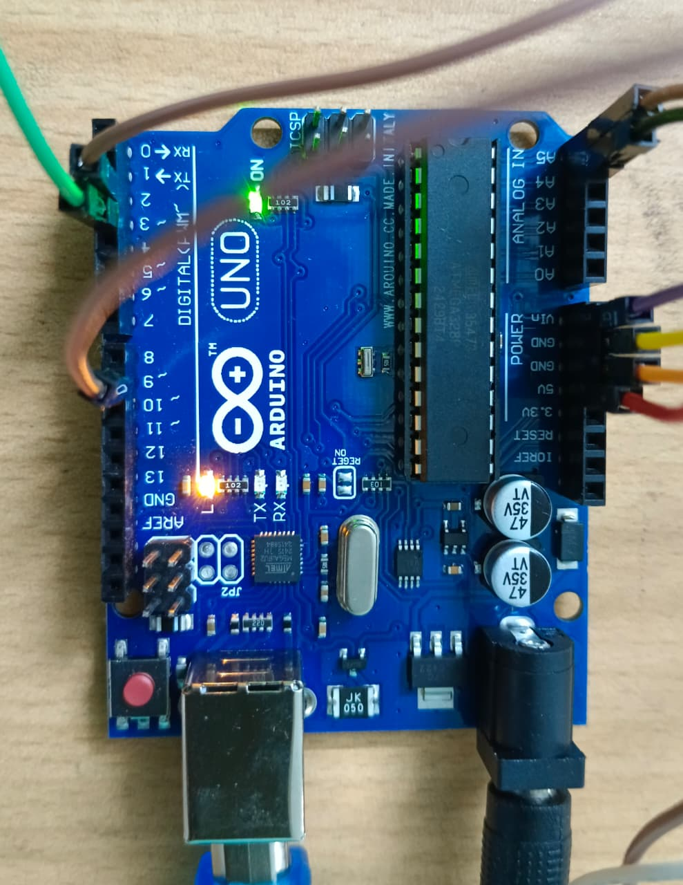

# smart-room-fan-automation
An Arduino-based smart system that automatically controls a fan based on room occupancy and temperature.

---

## 🚀 Features
- 👥 Detects number of people using IR sensors
- 🌡️ Monitors temperature using DHT11
- 🌀 Automatically controls fan speed (PWM)
- ⚡ Turns OFF fan when room is empty
- 📟 Displays real-time data on LCD

---

## 🛠️ Technologies Used
- Arduino (C/C++)
- Embedded Systems
- Sensors (IR, DHT11)
- I2C Communication
- PWM (Fan Control)

--- 

## 🔌 Components
- Arduino Uno
- DHT11 Temperature Sensor
- 2x IR Sensors
- 16x2 I2C LCD Display
- DC Fan
- Transistor (TIP122 or MOSFET)
- Diode
- Resistors
- Jumper Wires

---

## ⚙️ How It Works
1. **IR sensors** detect entry and exit of people.
2. **People counter** is updated based on IR sensors.
3. **DHT11** reads the current temperature.
4. **Fan control:**
   - Turns **OFF** if no people are present.
   - Turns **ON** if people are present.
   - **Speed** adjusts based on temperature:
     - 25–26°C → Low
     - 26–27°C → Medium
     - 27–28°C → High
     - ≥28°C → Maximum
5. **LCD Display**:
   - Shows **Temperature**
   - Shows **People count**

---

## Project Demo

